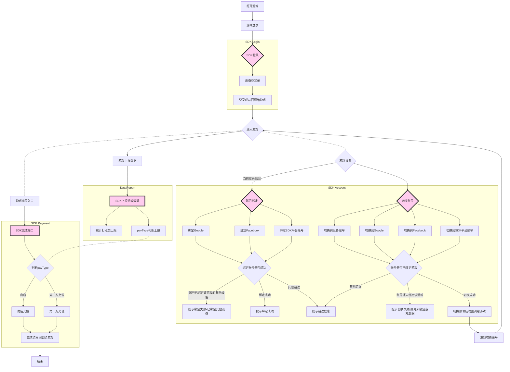

# SLG 游戏SDK 流程图

```mermaid
graph TB
    gameStart[打开游戏] --> gameLogin[游戏登录]
    gameLogin --> sdkLogin{SDK登录}
    subgraph SDK Login
        sdkLogin --> deviceLogin[设备ID登录]
        deviceLogin --> loginCallback[登录成功回调给游戏]
    end
    loginCallback --> enterGame{进入游戏}
    enterGame --> gameReport[游戏上报数据]
    subgraph DataReport
    	sdkReport[SDK上报游戏数据] --> gameEvent[统计打点类上报]
    	sdkReport --> payType[payType判断上报]
    end
    enterGame -.- gameSetting{游戏设置}
    gameReport --> sdkReport
    enterGame -.- gamePayment[游戏充值入口]
    gamePayment --> sdkPayment[SDK充值接口]
    subgraph SDK Payment
        sdkPayment --> checkPayType{判断payType}
        payType -.- checkPayType
        checkPayType -- 商店 --> storePayment[商店充值]
        storePayment --> paymentCallback[充值结果回调给游戏]
        checkPayType -- 第三方充值 --> otherPayment[第三方充值]
        otherPayment --> paymentCallback
    end
    paymentCallback --> stop[结束]
    gameSetting -- 当前登录信息 --> bindAccount{账号绑定}
    gameSetting --> exchangeAccount{切换账号}
    subgraph SDK Account
    	bindAccount --> bindGoogle[绑定Google]
    	bindAccount --> bindFacebook[绑定Facebook]
    	bindAccount --> bindSdkAccount[绑定SDK平台账号]
    	
    	exchangeAccount --> exchangeDevice[切换到设备账号]
    	exchangeAccount --> exchangeGoogle[切换到Google]
    	exchangeAccount --> exchangeFacebook[切换到Facebook]
    	exchangeAccount --> exchangeSdkAccount[切换到SDK平台账号]
    	
    	bindGoogle --> checkBindSuccess{绑定账号是否成功}
    	bindFacebook --> checkBindSuccess
    	bindSdkAccount --> checkBindSuccess
    	checkBindSuccess -- 账号已绑定该游戏的其他设备 --> 提示绑定失败-已绑定其他设备
		checkBindSuccess -- 绑定成功 --> 提示绑定成功
		checkBindSuccess -- 其他错误 --> 提示错误信息
		
		exchangeDevice --> checkIsBind{账号是否已绑定游戏}
		exchangeGoogle --> checkIsBind{账号是否已绑定游戏}
		exchangeFacebook --> checkIsBind{账号是否已绑定游戏}
		exchangeSdkAccount --> checkIsBind{账号是否已绑定游戏}
    	checkIsBind -- 账号还未绑定该游戏 --> 提示切换失败-账号未绑定游戏数据
		checkIsBind -- 其他错误 --> 提示错误信息
		checkIsBind -- 切换成功 --> exchangeCallback[切换账号成功回调给游戏]
    end
	exchangeCallback --> gameExchangeAccount[游戏切换账号]
	gameExchangeAccount --> enterGame

	style sdkLogin fill:#f9f,stroke:#333,stroke-width:4px,fill-opacity:0.5
	style sdkPayment fill:#f9f,stroke:#333,stroke-width:4px,fill-opacity:0.5
	style sdkReport fill:#f9f,stroke:#333,stroke-width:4px,fill-opacity:0.5
	style bindAccount fill:#f9f,stroke:#333,stroke-width:4px,fill-opacity:0.5
	style exchangeAccount fill:#f9f,stroke:#333,stroke-width:4px,fill-opacity:0.5
```
